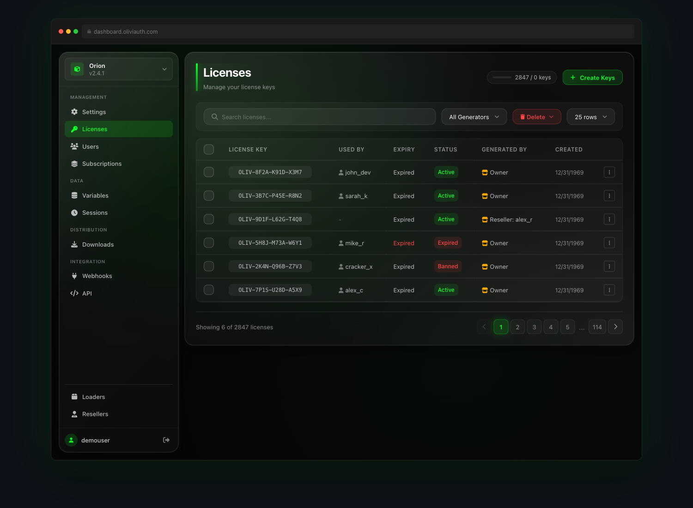

  

 

## what i'm building

**[Olivia Auth](https://olivia.run)** — software licensing & auth for developers who've outgrown KeyAuth.

 

  

 

### why not KeyAuth

| | KeyAuth | Olivia Auth |
|---|---|---|
| Session security | plaintext API | RSA key exchange → AES-GCM + XOR obfuscation |
| Discord integration | ❌ | native bot — create/revoke licenses from Discord |
| Real-time commands | polling | Socket.IO push to connected clients |
| Reseller system | limited | credit-based, full API, white-label |
| Team management | basic | 28 permission scopes, role presets, audit log |
| File distribution | ❌ | built-in loader hosting on Cloudflare R2 |
| Suspect detection | ❌ | multi-detector pipeline, alert jobs |

---

## stack

  
  
  
  
  
  
  
  
  
  

---

## stats

  
  

---

  <a href="https://olivia.run">olivia.run</a> &nbsp;·&nbsp;
  <a href="https://discord.gg/olivia">discord.gg/olivia</a>

  

